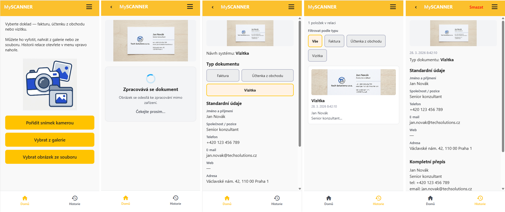

# Pozvánka: Prezentace — Cursor, skills a rules

**Krátký text do e-mailu:**

---

**Předmět:** Pozvánka na prezentaci — Cursor: skills, rules a vývoj s AI

---

Ahoj,

zvu tě na **prezentaci** (spíš než klasické školení), **trvá cca 90 minut**, na které se dozvíš, jak v Cursoru efektivně pracovat s **skills** a **rules** a co z toho můžeš mít v každodenním vývoji.

**O čem to hlavně bude**
- **Skills a rules** — co to je, k čemu slouží a jak je používat (na konkrétních příkladech z mého projektu).
- **Context-Driven Development** — jediný zdroj pravdy (PRD, rules, skills) jako společný kontext pro lidi i AI; odtud plán vývoje, plán testů a dokumentace; od specifikace přes etapy až po implementaci a bezpečnostní review s AI krok za krokem.

**Co si odneseš navíc**
- **Jak rychle udělat mobilní app** — během pár minut si vyzkoušíš vývoj a spuštění na telefonu pomocí Expo Go.
- **Jak řídit výstup AI** — např. aby UI a UX odpovídaly Jablotronnímu vzhledu (skill v akci).
- **Jak se napojit na OpenAI API** — konfigurace, bezpečné uložení klíče, volání z kódu.

**Pro koho**
- Pro každého, kdo používá nebo chce zkusit Cursor a rád by měl přehled o skills, rules a opakovatelných postupech s AI.

**Vyzkoušet si to sám**
- Vše si můžeš vyzkoušet i samostatně podle návodu v mém repozitáři: [github.com/shindy2m/my-scanner](https://github.com/shindy2m/my-scanner). V repu je návod v `docs/skoleni.md`, rules, skills a vše k tomu.

